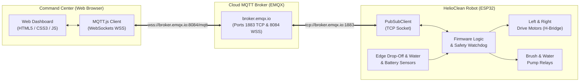

# HelioClean Solar Robot ☀️🤖

An industrial-grade IoT remote control and telemetry system for solar panel cleaning robots. Features an ESP32 firmware communicating via the public **EMQX MQTT Broker** (`broker.emqx.io`) and a standalone, high-performance web dashboard with real-time sensor monitoring, independent manual wheel throttle, and automated safety failsafes.

---

## 📐 System Architecture



---

## ⚡ Hardware Pinout (ESP32)

> [!IMPORTANT]
> **Strapping Pin Fix**: The brush relay was relocated from **GPIO 12 to GPIO 18**. GPIO 12 is an ESP32 strapping pin (`MTDI`); connecting it to an optical relay module with an internal pull-up causes the ESP32 to switch flash voltage to 1.8V and brick startup into an infinite bootloop (`flash read err`).

| Component | Pin (ESP32) | Function | Notes |
| :--- | :---: | :--- | :--- |
| **Left Motors (FWD)** | **GPIO 25** | PWM Forward (IN1) | 5 kHz 8-bit LEDC PWM |
| **Left Motors (REV)** | **GPIO 26** | PWM Reverse (IN2) | 5 kHz 8-bit LEDC PWM |
| **Right Motors (FWD)**| **GPIO 27** | PWM Forward (IN3) | 5 kHz 8-bit LEDC PWM |
| **Right Motors (REV)**| **GPIO 14** | PWM Reverse (IN4) | 5 kHz 8-bit LEDC PWM |
| **Cleaning Brush**    | **GPIO 18** | Relay Trigger | Active-LOW configurable |
| **Water Pump**        | **GPIO 19** | Relay Trigger | Active-LOW configurable |
| **Status LED**        | **GPIO 2**  | Onboard Blue LED | Blinks while connecting, Solid when online |
| **Left Edge Sensor**  | **GPIO 32** | Digital Drop-Off IR | Pullup enabled; stops fwd drive on edge |
| **Right Edge Sensor** | **GPIO 33** | Digital Drop-Off IR | Pullup enabled; stops fwd drive on edge |
| **Water Tank Sensor** | **GPIO 35** | Float Switch (Digital) | Input-only; locks pump when empty |
| **Battery ADC**       | **GPIO 34** | Voltage Divider ADC | Input-only; 100k/22k divider for 3S LiPo |
| **MPU6050 I2C SDA**  | **GPIO 21** | I2C Serial Data | Hardware I2C (400 kHz fast mode) |
| **MPU6050 I2C SCL**  | **GPIO 22** | I2C Serial Clock | Hardware I2C (400 kHz fast mode) |

---

## 🛡️ Built-in Safety & Sensor Logic

1. **Dead-Man's Switch (Safety Watchdog)**:
   - If the robot is driving and the Wi-Fi signal drops or the browser stops sending keep-alive packets for $> 650\,\text{ms}$, the firmware **immediately halts all drive motors**.
2. **Optical Edge Drop-off Protection**:
   - Two downward-facing IR sensors on the front corners detect the edge of solar panel frames.
   - If an edge is detected, forward drive is instantly cut and an alarm payload is broadcast to the dashboard. Reverse drive remains enabled to back away from the precipice.
3. **Dry-Run Water Pump Protection**:
   - A digital float switch in the water tank prevents the water pump relay from energizing if the fluid reservoir is depleted, saving the pump motor from burning out.
4. **Dynamic Braking for Sloped Panels**:
   - Solar panel arrays are tilted ($10^\circ - 35^\circ$). Setting both H-bridge terminals HIGH on stop provides dynamic magnetic braking to prevent gravity slippage on wet panels.
5. **Relay Polarity Protection**:
   - Configurable `RELAY_ACTIVE_LOW true` ensures relays initialize de-energized at power-on, preventing actuator activation during booting.
6. **6-Axis Inclinometer & Tilt Hazard Protection (MPU6050)**:
   - Measures Pitch and Roll incline angles on sloped solar panels in real-time. If the robot detects an excessive angle ($> 45^\circ$ tipping or sliding risk), it automatically halts all drive motors and raises a prominent alarm on the dashboard.

---

## 🕹️ Independent Manual Wheel Control

The web command center offers three modes of manual locomotion:
* **Dual Vertical Throttle Sliders**: Independent left and right track control (`-255` full reverse to `+255` full forward). Includes a toggleable **Auto-Center / Spring-Return** feature that snaps throttles to zero upon release.
* **2D Differential Virtual Joystick**: Smooth drag-to-steer touchpad that computes differential wheel speeds in real-time.
* **Hold-to-Run D-Pad**: High-visibility directional buttons (Forward, Reverse, Spin Left, Spin Right, Pivots) with keyboard hotkeys (`W`, `A`, `S`, `D`, `Q`, `E`, and `Spacebar` for Emergency Stop).

---

## 📡 MQTT Topic Specifications

**Base Topic:** `helioclean/<BOT_ID>/` (default `helioclean/bot1/`)

### 1. Telemetry (ESP32 $\to$ Dashboard)
* **Topic:** `helioclean/<BOT_ID>/telemetry`
* **Interval:** Every 1 second & on state change
* **Payload:**
```json
{
  "bot_id": "bot1",
  "uptime": 142,
  "rssi": -65,
  "motors": { "left": 150, "right": 150, "moving": true },
  "actuators": { "brush": true, "pump": false },
  "sensors": {
    "edge_left": false,
    "edge_right": false,
    "edge_warning": false,
    "water_empty": false,
    "battery_v": 12.35,
    "battery_pct": 89
  },
  "imu": {
    "connected": true,
    "pitch": 18.2,
    "roll": -1.4,
    "yaw_rate": 0.0,
    "temp": 29.5,
    "tilt_warning": false
  },
  "failsafe": { "timeout_active": false }
}
```

### 2. Status & LWT (ESP32 $\to$ Dashboard)
* **Topic:** `helioclean/<BOT_ID>/status`
* **Payload:** `online` or `offline` (retained with Last Will & Testament)

### 3. Drive Commands (Dashboard $\to$ ESP32)
* **Topic:** `helioclean/<BOT_ID>/cmd/drive`
* **Payload Formats**:
  * Dual wheel speeds: `{"left": 180, "right": -180}`
  * Directional command: `{"cmd": "forward", "speed": 160}`
  * Plain text: `"forward"`, `"reverse"`, `"spin_left"`, `"spin_right"`, `"stop"`

### 4. Actuator Commands (Dashboard $\to$ ESP32)
* **Topic:** `helioclean/<BOT_ID>/cmd/actuator`
* **Payload:** `{"brush": true}` or `{"pump": false}`

### 5. Emergency Stop (Dashboard $\to$ ESP32)
* **Topic:** `helioclean/<BOT_ID>/cmd/emergency`
* **Payload:** `{"emergency": true}` (cuts all motors, brush, and pump immediately)

---

## 🚀 Quickstart Guide

### 1. Flashing the Firmware (`promise.ino`)
1. Open [promise.ino](file:///c:/Users/USER/promise/promise/promise.ino) in Arduino IDE or VS Code PlatformIO.
2. Install the **PubSubClient** library via Library Manager (`Tools -> Manage Libraries...`).
3. Update your local Wi-Fi credentials:
   ```cpp
   const char* WIFI_SSID     = "Your_WiFi_Name";
   const char* WIFI_PASSWORD = "Your_WiFi_Password";
   ```
4. Select board **ESP32 Dev Module** and click **Upload**.
5. Open Serial Monitor at **115200 baud** to observe connection to `broker.emqx.io`.

### 2. Launching the Web Command Center
Open [web/index.html](file:///c:/Users/USER/promise/promise/web/index.html) in any modern web browser.

You can also run a local server:
```bash
# Python
python -m http.server 8000 --directory web

# Node.js
npx serve web
```
Then navigate to `http://localhost:8000`.